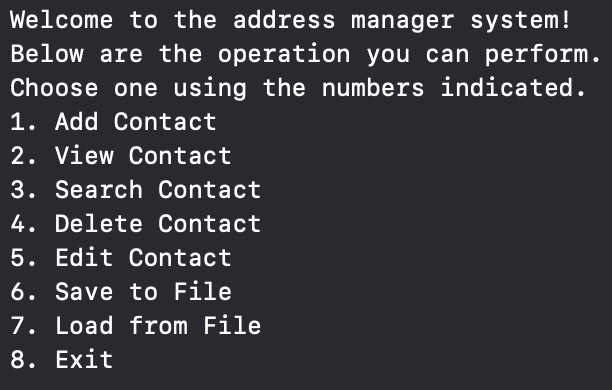
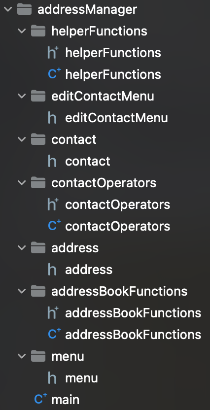
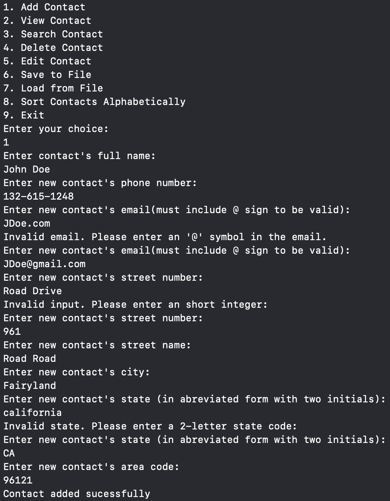

# Address Book Management System
## Project Overview

The Address Book Management System is a C++ application designed to help users store, manage, and organize their contacts efficiently. This project allows users to add, view, search, edit, and delete contacts, as well as save and load contacts from a CSV file. It's a console-based application that showcases the use of smart pointers, file handling, enumerations, and other key C++ features.

## Features

Add New Contacts: Capture essential contact information such as full name, phone number, email, street address, city, state, and area code.

Search Contacts: Quickly find a contact by name.

Edit Contacts: Update existing contact information.

Delete Contacts: Remove contacts from the address book.

View All Contacts: Display all stored contacts in a formatted manner.

File Operations: Save contacts to a CSV file and load contacts from a CSV file.

## Technology used

C++: Core language

Smart Pointers: For efficient memory management (std::unique_ptr)

File Handling: Using ifstream and ofstream for CSV file operations

Enums: For managing menu options

## Screenshots and Video

Main Menu:

Folder Layout:

Example test of menu(include some error handling):

markdown
    [Link to Video](https://drive.google.com/file/d/1amcYki0e_nS5ux4FtdyPJBKQq-Jzl_Hl/view?usp=sharing)

## Author

Isaac Guan
Currently a enrolled BCC and have always been interested in the workings of computers. Aspire to oneday create a game that many people can be enjoyed.

Email address: isaacguan8@gmail.com

Github profile link: https://github.com/IsaacGuan8

## License

This project is licensed under the MIT License. For more details see the LICENSE file.
